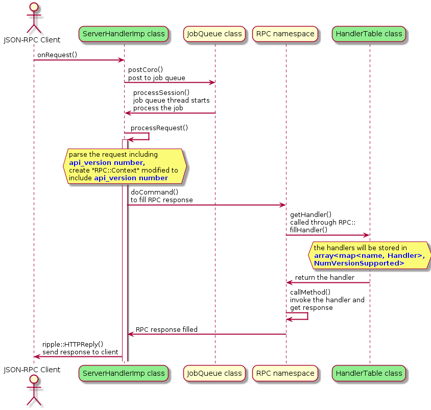

# Rippled RPC Design

The first several sections will be filled later.

## Overview

## Execution Concept

## Interfaces

## State Diagrams

## Classes and Sequence Diagrams

## Author defined Topics

### Rippled API Version Design

We have four sets of RPC interfaces, JSON-RPC, websocket RPC, rippled command line RPC, and gRPC. They have similarities as well as differences, such as the wire format (JSON vs protobuf) and the streaming capacity (no-stream, client-stream, server-stream, and bi-directional). They may also face different client-side developers with different conventions. So we will try to have the same set of [requirements](../requirement/requirements.md) and the same design, and acknowledge the differences when needed. 

#### Version Number

The API version number is a single 32-bit unsigned integer and starts from 1. We increase the version number if and only if we introduce breaking changes to the API. 

We support a range of consecutive API versions in rippled. The lower and higher bounds of the range will be hard-coded in rippled code. Different rippled software versions may support different API version ranges. When a rippled server receives a client request targeting an API version that is out of the supported version range, it rejects the request. For JSON-RPC and websocket RPC, the returned error message will include the string “Unsupported API version”, the version number targeted by the request, and the lower and higher bounds of the supported range. 


#### Breaking Changes

The table below lists the types of changes and their backwards-compatibility. The table is a work in progress.

<table>
  <tr>
   <td><strong>Changes</strong>
   </td>
   <td><strong>JSON-RPC & websocket</strong>
   </td>
   <td><strong>gRPC</strong>
   </td>
  </tr>
  <tr>
   <td>Deleting, renaming, changing the type of, or changing the meaning of a field of a request or a response message.
   </td>
   <td>breaking
   </td>
   <td>breaking
   </td>
  </tr>
  <tr>
   <td>Adding a new field to the request or the response message. (Note the exceptions with position based parameters below.)
   </td>
   <td>non-breaking
   </td>
   <td>non-breaking
   </td>
  </tr>
  <tr>
   <td>JSON based: Change the order of position based parameters. Or insert a new field in front of existing parameters. 
<p>
gRPC: Changing a proto field number.
   </td>
   <td>breaking
   </td>
   <td>breaking
   </td>
  </tr>
  <tr>
   <td>Deleting or renaming an API function. 
   </td>
   <td>breaking
   </td>
   <td>breaking
   </td>
  </tr>
  <tr>
   <td>Changing the behavior of an API function visible to existing clients
   </td>
   <td>breaking
   </td>
   <td>breaking
   </td>
  </tr>
  <tr>
   <td>Adding a new API function.
   </td>
   <td>non-breaking
   </td>
   <td>non-breaking
   </td>
  </tr>
  <tr>
   <td colspan="3" ><strong><em>The rows below are gRPC only breaking changes</em></strong>
   </td>
  </tr>
  <tr>
   <td>Deleting or renaming an enum, or an enum value.
   </td>
   <td>
   </td>
   <td>breaking
   </td>
  </tr>
  <tr>
   <td>Move fields into or out of a oneof, split or merge oneof
   </td>
   <td>
   </td>
   <td>breaking
   </td>
  </tr>
  <tr>
   <td>Changing the label of a message field, i.e. optional, repeated, required.
   </td>
   <td>
   </td>
   <td>breaking
   </td>
  </tr>
  <tr>
   <td>Changing the stream value of a method request or response.
   </td>
   <td>
   </td>
   <td>breaking
   </td>
  </tr>
  <tr>
   <td>Deleting or renaming a package or service
   </td>
   <td>
   </td>
   <td>breaking
   </td>
  </tr>
</table>


#### JSON-RPC

Add an "api_version" field in the request to indicate which API version the request is requesting.

```
{
    "method": "...",
    "params": [
        {
            "api_version": 2,
            ...
        }
    ]
}
```


This way of specifying the version number in the request message is self-contained and in line with the way [JSON-RPC specifying its own version](https://www.jsonrpc.org/specification). Since putting it at the top level is [not a good choice](https://github.com/ripple/rippled/issues/3065), it is placed in the [one-item array of “params” as required](https://xrpl.org/request-formatting.html).

The sequence diagram below shows a sunny day case of processing a JSON-RPC request. On the execution path, two classes are modified, ServerHandlerImp and HandlerTable. The modifications are in the yellow boxes, (1) the requests will have the “api_version” field, and (2) the request handlers is currently stored in a map (in the format of map<name, Handler>), they will be stored in an array of maps (in the format of array<map<name, Handler>, NumVersionSupported>, where NumVersionSupported is the number of API versions supported by this rippled server). If a handler does not change across different API versions, the same handler will be pointed by multiple entries of the array.





#### WebSockets RPC

Add an "api_version" field in the request to indicate which API version the request is requesting.

```
{
    "api_version": 2,
    "id": 4,
    "command": "...",
    ...
}
```

This is in line with our JSON-RPC request version field format. Following our [websocket request format convention](https://xrpl.org/request-formatting.html), it is placed on the top level. The rippled code changes required will be similar to JSON-RPC as shown in the section above.


#### Rippled command line RPC

The RPC command and its parameters passed to rippled command line are parsed first and a JSON-RPC request is created and sent to a rippled server. We will not support multiple versions of the command-parameter parsers. Hence all the JSON-RPC requests generated by a particular rippled software version will have one API version number. We will use the latest API version number. In the rippled code, the "api_version" field will be inserted into the JSON-RPC request before being sent to a rippled server.


#### gRPC

The version number of gRPC requests are specified as part of the package name of gRPC’s service definition in .proto files. Some of the well known projects (such as [uber](https://github.com/uber/prototool/blob/dev/style/README.md#package-versioning) and [envoy](https://github.com/envoyproxy/data-plane-api/tree/master/envoy/api)) use this approach. We recommend to place the .proto files of different versions in version specific folders. 

The example .proto file defines a version 2 service “Greeter” that has an RPC function “SayHello”.


```
syntax = "proto3";

package helloworld.v2;
import "helloworld_msg.proto";

service Greeter {
  rpc SayHello (.helloworld_msg.HelloRequest) returns (.helloworld_msg.HelloReply) {}
}
```


In the generated cpp file, the package name is translated to namespaces. Among other code, it declares a server side “Greeter::AsyncService” class and a “RequestSayHello” method, and a client side “Greeter::Stub” class and a “SayHello” method. The gRPC clients and servers will use the “SayHello” method and the “RequestSayHello” method to communicate. The code below is reduced from the generated cpp file.


```
...
namespace helloworld {
namespace v2 {

class Greeter final {
 public:
  static constexpr char const* service_full_name() {
    return "helloworld.v2.Greeter";
  }
  
  //server side
  class WithAsyncMethod_SayHello : public BaseClass {
    void RequestSayHello(::grpc::ServerContext* context, ::helloworld_msg::HelloRequest* request, ::grpc::ServerAsyncResponseWriter< ::helloworld_msg::HelloReply>* response, ::grpc::CompletionQueue* new_call_cq, ::grpc::ServerCompletionQueue* notification_cq, void *tag);
  };
  typedef WithAsyncMethod_SayHello<Service > AsyncService;
  
  //client side
  class Stub final : public StubInterface {
    ::grpc::Status SayHello(::grpc::ClientContext* context, const ::helloworld_msg::HelloRequest& request, ::helloworld_msg::HelloReply* response) override;
  };
  static std::unique_ptr<Stub> NewStub(const std::shared_ptr< ::grpc::ChannelInterface>& channel, const ::grpc::StubOptions& options = ::grpc::StubOptions());
}
```


At the gRPC server side, multiple versions of the API are created by constructing multiple services, e.g. helloworld::v2::Greeter::AsyncService. The services are located in different namespaces. They are simply different services from gRPC’s point of view. All of the services can be registered to a single gRPC server. 

The gRPC client must know the gRPC server’s IP:port to connect. Once connected, the client can invoke RPCs from different API versions by constructing the stubs from different namespaces and then calling the stub methods. ([In distributed computing, a stub means a piece of code that converts parameters passed between client and server.](https://en.wikipedia.org/wiki/Stub_(distributed_computing)) In the example above, helloworld::v2::Greeter::Stub is the client side class for invoking the RPC.) The matching of a client stub to the corresponding server service is done by the generated gRPC code behind the scenes. 


#### The “Version” RPC function

One of the existing RPC functions is the Version function. When invoked, it currently replies: 

"Version":{"first":"1.0.0","good":"1.0.0","last":"1.0.0"}

With the planned change, it will reply

"Version":{"first":"1.0.0","good":"2.0.0","last":"2.0.0"}, if request’s api_version is 1 or missing

"Version":{"api_version_high":2,"api_version_low":1}, if request’s api_version is 2


#### Future work

According to the current design of the [native support for gRPC in rippled](https://github.com/cjcobb23/grpcRippledDesign/blob/master/design/design.md), the code paths of processing a gRPC request and processing other types of requests are in parallel. The design of transcoding gRPC requests to JSON formatted requests which can be handled by the existing set of handlers was considered and discarded. In the future, it may be desirable to merge the code paths to provide a unified RPC approach with single source of truth. One approach is by transcoding JSON formatted requests to protobuf requests (via [protobuf’s json_util](https://developers.google.com/protocol-buffers/docs/reference/cpp/google.protobuf.util.json_util), or other ways), and then invoking the protobuf requests’ handlers, the version number and command name should be parsed out and used to locate the handler. I.e., we may need something similar to the current rippled’s HandlerTable class. 
